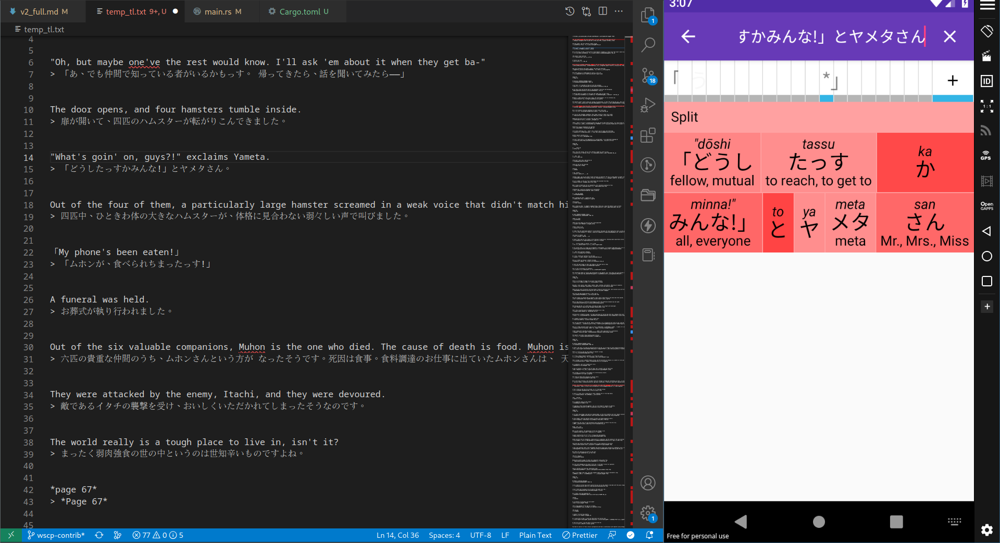

## Who?

Raghav Shankar, person. As may be evident from the content on this site, I like Japanese things. I also happen to like computers. 

## What?

This blog exists to document the things I do and to let the world at large know that I exist, in a more concrete way. I post my translations here for you to read and for me to reap ad money from (Please don't adblock this site, I promise you'll only see a few banner ads and none of those inter-page ones). You can find my technical articles on this blog as well (I swear, I'll post actual technical stuff someday).

## Where?

I live in Bangalore, India. If you'd like to contact me, send me a message at  `warpspeedscp(at)gmail.com`, and I'll get back to you.

## How?

### Translation

Translating Japanese to English isn't easy. Here are some tips to make it less of a pain.

- Learn Japanese grammar well. 
    - This includes everything from tenses, verb forms, how particles work, sentence structure, just everything. 
    - It helps if you are already familiar with similarly structured languages (most languages from India follow a similar structure to Japanese, though there are likely others that are similar as well), as you can more easily translate between such languages.
- Use [Akebi](https://play.google.com/store/apps/details?id=com.craxic.akebifree&hl=en_IN&gl=US).
    - Akebi is this really nice Japanese dictionary app for Android, which has a lot of very nice features. 
    - It also has great support for Japanese idioms and stuff, and can even break up sentences into constituent kana for easy parsing. 
    - Also, it doesn't cost anything, is completely ad-free, and even works offline!
    - I use Akebi on my computer using genymotion, so I can easily do translation while I look up meanings on the side, like so:
    
    
- Use DeepL, or something like Sugoi Japanese Translator.
    - DeepL is great at translating Japanese into English.
    - It does come with some rate limiting, so make sure you don't request too many translations at a time.
    - Sugoi is a better deal, imo. It can give comparable results, for free.
        - All you need to do is download the latest sugoi toolkit, hope your computer is beefy enough, and then run sugoi translator.
        - I'm on Linux, so some things just work differently. But you can hop on their Discord if you need help.
        - If you'd like to support the sugoi project more, consider throwing a few bucks at them on their patreon. You'll get access to their latest translation model sooner and believe me, it makes a difference.
    - DO NOT RELY SOLELY ON ANY MACHINE TRANSLATION TOOL FOR YOUR TRANSLATIONS. 
        - Bare MTL is annoying, and I've read enough shitty 10-minute tl jobs to know. I only use tools such as DeepL to clear up any confusing bits I come across. Machine translation, even with the fancy AI stuff we have nowadays, is unable to figure out context properly. And puns are pretty much obliterated, usually.
        - My goal is to provide a quality translation comparable to what competent teams such as J-Novel club (They genuinely have the best publishing model ever) provide. That doesn't happen without going through the text word by word, and truly understanding the author's intent.
        - It takes a lot of time since I'm doing things alone (and real life isn't going to wait around for me either), but it's worth the extra effort.
- Be in it for the long haul.
    - Quality translation takes time and effort, be ready to put hours into this hobby. 

## My Setup

I use a bog-standard gaming laptop, some version of the Acer Nitro 5. 

Here are its specifications:

- A 11th gen i5 (11400H) CPU
- 24 Gigabytes of DDR4 RAM
- A 4GB RTX-3050
- A 2TB Samsung SSD

I dual-boot Windows 10 on one puny 256 GB NVMe drive, and whatever the latest version of EndeavorOS is. It's nice, like a better version of Manjaro.

I dream of the day I can stop using Windows forever, so I can delete that stupid gremlin in my hard drive that keeps messing with my UEFI boot entries.

<!-- You can tell I'm jaded. -->
