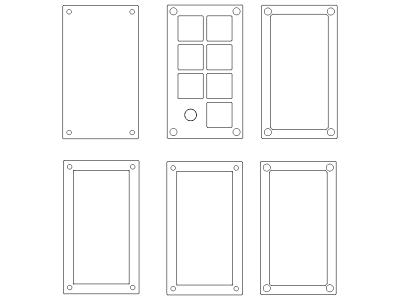

## The Motivation

A while ago, I'd asked my cousin in the US to get me some [choc sunset switches](https://www.google.com/search?q=choc+sunset) (along with a few other things) for a 34 key build. But I could only order in sets of 10, so I ended up with 6 more switches to spare. I immediately knew what I would do with those 6 switches - create a macro pad!

I'd initially wanted to do this for a more specific reason: chat hijacking at the office. The doofy dodos <!-- I call them that because they all got laid off --> of my department delight in declaring dastardly donations of drinks and desserts within discussions upon discovery of deserted desktops (try saying that three times fast). Of course, the "easy" solution is to make sure to lock your computer when you get up. But what if you forget and want to quickly lock your laptop at a distance?

The answer was to build a remote control, a [*key fob*](https://dictionary.cambridge.org/dictionary/english/key-fob).

## Choosing an MCU

I had a vague idea of how to get this done; I'd recently gotten some [nice!nano](https://nicekeyboards.com/nice-nano/)s from [rectangles.store](https://rectangles.store) which I used in [my first really custom](https://old.reddit.com/r/ErgoMechKeyboards/comments/wpngbj/ferrous_sweep_ferricy_mod_with_beeg_batteries/) wireless Ferricy build.

But the nice!nano is a rather large MCU. I wanted the bluetooth, the power efficiency and the battery charge controller of a nice!nano without the giant footprint (and the equally giant price tag). And well, there's no Nordic-based MCU smaller than the [Seeed Studio Xiao BLE](https://wiki.seeedstudio.com/XIAO_BLE/), short of directly using the chip itself. It's only got 14 pins, but that's more than enough for my needs. The price being less than half of the nice!nano helps too. The only thing of any consequence the Xiao BLE doesn't have is the 500mA boost jumper for faster charging.

### The Final BOM

Here's the final list of parts I used in this build:

| Part Name                                                                                                         | Number required |
| ----------------------------------------------------------------------------------------------------------------- | --------------- |
| Pololu SPDT slide switch (or an equivalent; they're all the same)                                                 | 1x              |
| Seeed Studio Xiao BLE (nRF52840; don't buy the sense variant - it's costlier and useless for this build.)         | 1x              |
| A 300mAh battery (it should be okay even if the dimensions don't match too closely.)                              | 1x              |
| Choc Sunset low profile switches + choc compatible keycaps (I got mine at [lowprokb.ca](https://www.lowprokb.ca)) | 6x              |
| Alps EC11 compatible encoder (I used a KY-040)                                                                    | 1x              |
| 20mm long, 2mm diameter standoffs                                                                                 | 4x              |
| M2x0.4 screws (with your choice of head)                                                                          | 8x              |
| Rubber feet                                                                                                       | 4x              |

I'm not including links, because I bought most of these components from a website within my own country. I suggest you find a good website that can deliver these components to you; it should not be difficult. [Here's a good place to start](https://old.reddit.com/r/MechanicalKeyboards/wiki/index#wiki_where_to_buy_and_sell_keyboards_and_keys) if you'd like to know where to source parts from.

## Designing the Enclosure

I decided to save on materials and time by hand-wiring this build. That meant the case had to be sturdy, yet light, since I wouldn't have a PCB backbone to rely on for rigidity. The case would need to have space for six keys, plus a hole for a rotary encoder. My initial iteration looked like this:

There were a few problems with this design.

1. I couldn't secure the encoder in place because the ones I bought didn't come with their own nuts.
2. The spacing between the individual key cutouts was too small.
   - I could only fit the switches onto the top plate without keycaps.
   
1. The inner and outer sizes of the frame were too small.
   - This made the middle pieces especially brittle at the corners with large holes for standoffs.
2. I'd also accidentally drawn up two top plates in the `dxf` file, so this was, in the end, never going to be viable.

On to the next one.

This design had similar problems; one very apparent one is the fact that one of the pieces was quite brittle and broke when I accidentally flexed it a bit too much. You can see the break in the bottom-right corner of the bottom-center piece. Ignore the missing bit at the bottom-left; I made a miscalculation in the design that meant that part was destined to be separate.

By now, I'd finally wised up to the fact that I had to rethink spacing and hole sizes. Here's the final version of the design I came up with:

You'll notice this version has 1 piece more; this was so there'd be more room inside for all the parts to fit. I redesigned the controller mount to integrate a bracket (The second piece from the top-left, specifically) for extra stability. I also experimented a little with including two differently-sized locking nuts for the encoder, just in case I'd need them.

Here's a picture of the pieces before assembly, with switches, encoder and controller mounted:

There's a quirk in this design that I'd like to point out - the controller is positioned at the bottom instead of at the top, under the encoder. I did this because I didn't want the encoder's bulky bottom half to clash with the controller or its support structure.

The battery and controller sit at the bottom of the macropad:

## ZMK

Next, I worked on putting together a ZMK firmware image for the macropad. I based the configuration files on the [new shield guide](https://zmk.dev/docs/development/new-shield) ZMK provides. There wasn't much to it; I copied a bit of this and a bit of that and voilà, the keys worked - but the encoder connections were a bit messed up. 

At first, I thought I'd have to use the extra [free GPIO pins](https://old.reddit.com/r/olkb/comments/11hl7is/extra_gpio_on_seeed_xiao_controllers_via_zmk/jaw6wvg/?context=10) available on the non-sense (hah) version of the Xiao BLE, because those are high frequency pins that aren't affected as much by RF leakage or whatever. I even soldered it all together very precariously with speaker wire, but ZMK didn't really like my work or something (It was probably because I was compiling it wrong) and I ended up redoing it to use non-high frequency pins. It works well enough, so I'm inclined to believe interference isn't much of an issue.

It's important to test that all the key connections work right too. Make sure each pin does what it's supposed to before you solder everything together. It'll save you a lot of time later on.

## Putting it Together

I was satisfied enough with the design by now, so I decided to try assembling it to make sure everything looked okay, but something went wrong here too.

I'd forgotten that the power switch's cross-section was about 4mm, while the pieces of the plates were only 3mm tall. That meant I had to file down a small section of the bottom half of one of the plates. Except I didn't have a file that I could use to neatly do it, so I ended up using sandpaper. The results speak for themselves.

Then, I soldered everything together:

Yeah, it's a mess. 

The battery is wired with the black lead connected directly to `B-`, while the red lead first makes a stop at the power switch before connecting to `B+`. 

One other problem I encountered was that I couldn't reach the reset button in the top-left corner of the controller (there is no reset pin on the Xiao BLE, only a button) because of the upper bracket. That meant I wouldn't be able to put the controller into bootloader mode if the firmware decided to act up. So I cut up the bracket a bit to accommodate it:

The power button needed a bit of superglue to keep it from getting pushed back into the case whenever I touched it as well.

Finally, I made sure to flash the latest firmware version I'd compiled, stacked all the layers together, and tightened all the screws. It looks pretty good, if I say so myself.

## The Micropad in Use

<blockquote class="reddit-embed-bq" style="height:500px" data-embed-height="518"><a href="https://www.reddit.com/r/MechanicalKeyboards/comments/16qzag0/made_a_key_fob_for_my_computer/">Made a key fob for my computer.</a>  by<a href="https://www.reddit.com/user/warpspeedSCP/">u/warpspeedSCP</a> in<a href="https://www.reddit.com/r/MechanicalKeyboards/">MechanicalKeyboards</a></blockquote>

It's nice. I can switch between devices, with volume, media controls and some other miscellaneous things, and the thing can last quite a long time thanks to ZMK's efficiency. I can even use this macropad with my phone! One funny thing that happened was my phone decided to start an emergency call when I accidentally pressed the micropad's lock button one too many times. Goes to show OnePlus thought of everything - even keyboards - I guess. 

You can find the firmware with an overview of the layout over in my [GitHub](https://github.com/WarpspeedSCP/micropad), along with the case `dxf` file.